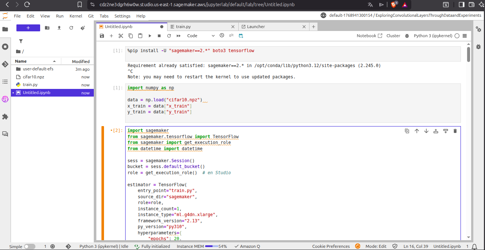
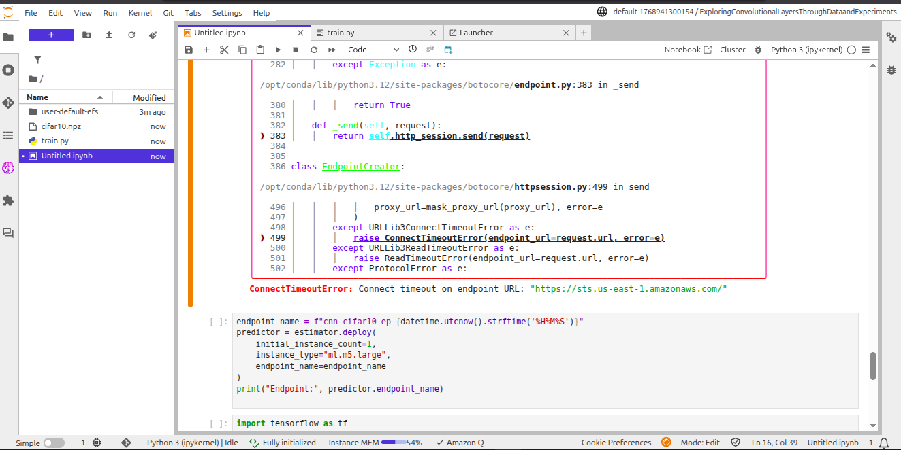

# Exploring Convolutional Layers Through Data and Experiments

> A structured study of convolutional inductive bias for image classification, comparing dense baselines against progressively scaled CNN architectures on CIFAR-10.

---

## Table of Contents

- [Overview](#overview)
- [Problem Description](#problem-description)
- [Dataset Description](#dataset-description-cifar-10)
- [Architecture Diagrams](#architecture-diagrams)
- [Experimental Results](#experimental-results)
- [Interpretation](#interpretation)

---

## Overview

In this course, neural networks are studied as **architectural systems** whose design choices affect performance, scalability, and interpretability. This project uses **convolutional layers** as a concrete lens through which to examine the concept of *inductive bias* — the set of assumptions built into a model's structure that guide how it generalizes from training data.

The central question driving this work is: *Why do convolutional architectures outperform flat dense networks on visual tasks, and by how much?* The answer is explored empirically through controlled experiments on CIFAR-10.

This is not a benchmark-chasing exercise. The goal is to build an architectural understanding of *why* certain design decisions work, tracing the connection from mathematical structure (weight sharing, local receptive fields, hierarchical composition) to observed behavior (accuracy, generalization gap, parameter efficiency). Every architectural choice in this project — kernel size, filter count progression, pooling strategy, normalization scheme — is made with an explicit justification.

---

## Problem Description

The objective is to evaluate why **convolutional inductive bias is more effective than dense-only baselines** for image classification tasks.

### Experimental Setup

Three distinct experimental conditions are compared:

| Condition | Description |
|---|---|
| **Dense Baseline** | A non-convolutional architecture that flattens the input and processes it through fully connected layers, deliberately ignoring spatial structure |
| **CNN Architecture** | A convolutional network explicitly designed for spatial feature extraction, using stacked Conv2D blocks with max pooling and global average pooling |
| **Controlled Filter Study** | A series of CNN variants where only the number of filters varies, isolating filter count as the experimental variable and holding all other hyperparameters fixed |

The baseline is not included as a strawman — it represents the best achievable accuracy when spatial structure is deliberately discarded. Any performance gap between the baseline and a CNN configuration is attributable specifically to the structural assumptions encoded by convolution, not to differences in training budget or optimization settings.

### Success Criteria

A result is considered successful when it achieves **improved validation and test performance** over the baseline, with a defensible trade-off between:

- **Model capacity** — total number of trainable parameters
- **Training cost** — wall-clock time and computational overhead
- **Generalization** — the gap between training and validation/test accuracy

A model that achieves high training accuracy at the cost of a large generalization gap is not considered a success, even if its test accuracy is high. The goal is to understand *why* a model works, not just to maximize a metric.

---

## Dataset Description (CIFAR-10)

[CIFAR-10](https://www.cs.toronto.edu/~kriz/cifar.html) is used as the target dataset. It is a standard benchmark for supervised image classification consisting of small RGB images across ten balanced object categories.

### Dataset Properties

| Property | Value |
|---|---|
| Number of classes | 10 |
| Image shape | `32 × 32 × 3` (RGB) |
| Training images | 50,000 |
| Test images | 10,000 |
| Samples per class | 5,000 (uniform) |

**Classes:** `airplane`, `automobile`, `bird`, `cat`, `deer`, `dog`, `frog`, `horse`, `ship`, `truck`

### Why CIFAR-10 is appropriate for this study

CIFAR-10 was selected over simpler alternatives (MNIST, Fashion-MNIST) and more complex ones (CIFAR-100, ImageNet subsets) for three specific reasons:

1. **Spatial structure is non-trivial but tractable.** At 32×32 pixels with 3 RGB channels, images are small enough to train quickly on a CPU/single GPU, but complex enough that a dense baseline genuinely struggles — the gap between dense and convolutional models is large and informative. MNIST is too easy: even a dense model reaches ~98% accuracy, which obscures the structural advantage of CNNs.

2. **RGB channels enable multi-channel feature learning.** Unlike grayscale datasets, CIFAR-10 requires the network to learn joint spatial and spectral patterns (e.g., the blue of a sky vs. the green of grass both inform object class). This makes it a realistic test of convolutional filter behavior across input channels.

3. **Class structure exercises both low- and high-level features.** Some class pairs (e.g., `cat` vs. `dog`, `deer` vs. `horse`) are visually similar and require fine-grained discrimination, while others (e.g., `ship` vs. `truck`) differ more coarsely. This diversity makes the task sensitive to the quality of learned representations at multiple levels of abstraction.

### In-memory feasibility

All images fit comfortably in RAM on standard hardware. The memory footprint in `float32`:

$$\text{Memory} \approx 60{,}000 \times 32 \times 32 \times 3 \times 4 \approx 703 \text{ MiB}$$

This leaves ample headroom for model weights, gradients, and training buffers on an 8–16 GB machine.

### Preprocessing Pipeline

All images were preprocessed with the following steps before being fed into any model:

- **Pixel normalization** — values rescaled from `[0, 255]` to `[0.0, 1.0]` using `float32` dtype. This prevents gradient magnitude mismatches in early layers (unnormalized inputs would produce gradients ~255× larger), stabilizing Adam optimization. Channel-wise z-score standardization was considered but not used: because all three RGB channels share the same natural scale, a single constant divisor is sufficient and avoids the risk of data leakage from computing dataset-level statistics.
- **Shape verification** — training tensor confirmed as `(50000, 32, 32, 3)` prior to training to detect any silent reshape errors from the data loading pipeline.
- **Class balance check** — distribution confirmed uniform at 5,000 samples per class, ruling out class imbalance as a confounding factor. A balanced dataset means plain accuracy is a valid metric without class-weight corrections: the random-chance baseline is exactly 10%, and the maximum possible class entropy $H(Y) = \log(10)$ is achieved.
- **Visual inspection** — a sample grid of images per class was reviewed to verify label consistency and assess intra-class variability. Key observations: classes like `cat`, `dog`, and `bird` show large variation in pose, scale, and background, confirming that the model cannot rely on rigid templates. Pairs like `deer`/`horse` and `airplane`/`bird` share visual backgrounds, indicating that fine-grained feature learning will be necessary for good performance.

---

## Architecture Diagrams

Two core architectures are evaluated: a dense-only baseline and a full CNN. Their structures are deliberately kept comparable in depth, but differ fundamentally in how they process spatial information.

### Baseline — Dense Network

The baseline flattens the input image into a 1D vector and processes it through two fully connected layers. This approach **discards all spatial structure** from the input.

The Flatten operation reshapes the `32×32×3` tensor into a `3072`-dimensional vector. At this point, two pixels that were spatially adjacent in the original image become just two arbitrary indices in a flat list — the network has no way to know they were neighbors. The Dense layers must then learn spatial correlations implicitly from positional co-occurrences in the training data, which is an extremely inefficient use of parameters.

The first Dense layer alone requires $(3072 + 1) \times 512 = 1{,}573{,}376$ parameters — over 92% of the model's total capacity — yet achieves only ~40% test accuracy. This makes the cost of ignoring spatial inductive bias concrete and measurable.

### CNN — Convolutional Network

The CNN preserves spatial layout by applying convolutional filters locally across the image. Two convolutional blocks (each with two Conv2D layers followed by max pooling) progressively extract features at increasing levels of abstraction before a global pooling operation collapses spatial dimensions.

The progression across blocks is intentional: Block 1 operates at full 32×32 resolution and learns low-level features (oriented edges, color gradients, local textures). After MaxPool(2×2), Block 2 operates at 16×16 and combines those features into intermediate patterns (texture regions, object parts). Block 3 at 8×8 produces high-level representations that are summarized by GlobalAveragePooling into a single vector per filter, which is then passed to the classifier. This hierarchy mirrors how visual information is organized in natural images: local → regional → global.

### Architectural Design Decisions

Each element of the CNN design was chosen for a specific reason, not by convention:

| Decision | Choice | Justification |
|---|---|---|
| **Kernel size** | 3×3 | Covers a meaningful neighborhood (~9% of image width) at low parameter cost. Two stacked 3×3 layers have the same effective receptive field as one 5×5, but with an extra non-linearity and fewer parameters. |
| **Stride** | 1 (within conv layers) | Keeps spatial resolution intact within each block, delegating downsampling exclusively to MaxPool. This separates feature learning from spatial compression. |
| **Padding** | `same` | Preserves spatial dimensions through each Conv2D layer so that feature maps have predictable, computable sizes at every stage. |
| **Filter progression** | 32 → 64 → 128 | Each MaxPool halves $H$ and $W$, reducing volume by 4×. Doubling filters compensates, keeping $H \times W \times C$ approximately constant and matching representational capacity to feature complexity. |
| **Pooling** | MaxPool2D(2×2) | Selects the strongest activation in each 2×2 window — answers "is this feature present anywhere in this region?" — without diluting it (which AvgPool would do). Also provides limited translation invariance within each window. |
| **Activation** | ReLU | Avoids vanishing gradients (gradient is 1 for positive inputs, 0 otherwise), enables stable backpropagation through multiple layers, and is computationally trivial. |
| **Global Average Pooling** | After last conv block | Collapses each 8×8 feature map to one scalar, producing a 128-dim vector without a large Dense layer. The alternative (Flatten) would add ~1M parameters in the classifier head and significantly increase overfitting risk. |
| **Dropout rate** | 0.3 | A moderate rate that injects regularizing noise without removing too much information per forward pass. Applied only in the Dense head, since convolutional features are already regularized by weight sharing. |

### Parameter Comparison

Despite being a more expressive and better-performing architecture, the CNN uses **significantly fewer parameters** than the dense baseline:

| Architecture | Parameters |
|---|---:|
| Baseline (Dense) | `1,707,274` |
| CNN (`big` config) | `157,226` |

This ratio (10.9×) makes concrete what it means to have the wrong inductive bias: over 1.5 million extra parameters that fail to compensate for the absence of spatial structure in the baseline's design.

---

## Experimental Results

The following table summarizes the results of both the baseline evaluation and the controlled filter-scaling study. Each CNN variant follows the same architecture but differs in the number of filters applied at each convolutional layer. All other training conditions (optimizer, batch size, early stopping patience, data split) were held fixed, so performance differences are attributable exclusively to filter count.

| Model | Filter Config | Parameters | Peak Val. Accuracy | Test Accuracy | Val. Loss | Train Time |
|---|---|---:|---:|---:|---:|---:|
| `baseline` | n/a | 1,707,274 | 0.4178 | 0.3993 | — | — |
| `small` | (8, 16) | 14,450 | 0.6078 | 0.6092 | 1.0815 | — |
| `medium` | (16, 32) | 44,762 | 0.7524 | 0.7506 | — | — |
| `big` | (32, 64) | 157,226 | 0.7926 | 0.7937 | — | ~111.5 s |
| `extra_big` | (64, 128) | 589,514 | 0.8136 | 0.8049 | 0.5796 | ~151.5 s |

> **Baseline reference metric:** test loss = `1.6869`

### Key Findings

**Monotonic accuracy gain with filter count.** Increasing filter capacity consistently improves validation performance across all four configurations (0.6078 → 0.7524 → 0.7926 → 0.8136). This confirms that filter count is a meaningful lever for representational capacity in this task: more filters allow the network to learn a richer vocabulary of local detectors and higher-level combinations of those detectors.

**Diminishing returns at scale.** The accuracy gains are nonlinear relative to parameter growth. Moving from `small` to `medium` yields ~15 percentage points with a 3× parameter increase; moving from `big` to `extra_big` yields only ~2 percentage points with a 3.75× parameter increase. This pattern reflects that beyond a moderate capacity, the marginal value of additional filters decreases — many learned filters become redundant, detecting variations of patterns already captured by other filters in the bank.

**Overfitting pressure increases with model size.** The generalization gap (train accuracy − validation accuracy) grows with filter count: `medium` shows a gap of ~0.047, `big` ~0.093, and `extra_big` ~0.120. This is consistent with higher-capacity models memorizing training data more aggressively under fixed regularization conditions. The fixed Dropout(0.3) becomes relatively weaker as the dense head's representational power grows, suggesting that larger configurations would benefit from stronger regularization (higher dropout, weight decay, or data augmentation).

**CNNs dominate the baseline decisively across all scales.** Even the smallest CNN (`small`, 14K parameters) outperforms the dense baseline (1.7M parameters) by approximately 20 percentage points. This result cannot be explained by parameter count alone — it demonstrates that architectural alignment with the data-generating process is more important than raw model capacity.

---

## Interpretation

### Why Convolutions Outperform Dense Layers on Images

Convolutional models outperform the dense baseline because they **preserve and exploit the spatial structure** inherent in image data. When an image is flattened into a vector, all positional relationships between pixels are erased — the network must then relearn those spatial dependencies implicitly, which requires far more data and capacity than explicitly encoding them as a structural prior.

The empirical evidence in this project makes the cost of this mismatch concrete: the dense baseline uses 10.9× more parameters and reaches only ~40% accuracy, while the `big` CNN uses fewer parameters and reaches ~79% accuracy. The performance gap is not due to training budget or optimization differences — all conditions were kept identical. The gap is purely architectural.

Convolution encodes three structural assumptions (**inductive biases**) that are well-matched to the statistics of natural images:

| Inductive Bias | Meaning | How it manifests in this architecture |
|---|---|---|
| **Locality** | Nearby pixels carry semantically related information (edges, textures, shapes). | 3×3 kernels compute each output activation from a 9-pixel neighborhood, not from the entire image. |
| **Weight sharing** | The same feature detector (filter) is reused at every spatial position, since objects can appear anywhere in the image. | One 3×3 kernel with 3 input channels has only 28 parameters, but is applied at all 1,024 spatial positions of a 32×32 map. |
| **Translation equivariance** | A pattern detected in one region of an image produces a consistent response if that pattern shifts spatially. MaxPool promotes partial *invariance* within each pooling window. | The same filter detects a horizontal edge at position (5,5) and at position (20,20). MaxPool(2×2) means a feature shifted by 1 pixel within a window still produces the same pooled output. |

Together, these properties allow convolutional networks to **generalize from fewer examples** and learn compact representations of visual structure that transfer across spatial positions.

### When Convolution Is Not Appropriate

The same structural assumptions that make convolutions powerful on images become liabilities in other settings. Convolution is inappropriate when:

- **The data has no spatial grid structure** — tabular data (financial records, clinical measurements) consists of heterogeneous features whose ordering is often arbitrary. There is no meaningful sense in which column 5 is "adjacent" to column 6.
- **Relationships are non-local or global by nature** — tasks like machine translation or long-document understanding require modeling dependencies between tokens that are far apart. Transformers with global self-attention are better matched to these problems because they do not impose a locality constraint.
- **The structure is irregular** — graph-structured data (social networks, molecular graphs, knowledge bases) lacks a fixed Euclidean grid. Graph neural networks define neighborhoods by connectivity, not spatial proximity.
- **Absolute position carries semantic meaning** — in certain scientific or sensor data, the index of a feature encodes a specific physical quantity. Translation equivariance would be harmful rather than helpful, since the "same feature at a different position" may mean something entirely different.

The guiding principle: use convolution when the domain has grid-like structure and locally reusable patterns. Choose a different inductive bias when the problem structure does not match those assumptions.

### Practical Model Selection Guide

| Objective | Recommended Config | Rationale |
|---|---|---|
| Maximum accuracy | `extra_big` | Highest test accuracy (80.5%); acceptable training time (~151 s) but higher overfitting pressure |
| Accuracy / efficiency balance | `big` | Strong accuracy (79.4%) at ~4× fewer parameters; smaller generalization gap makes it the most defensible operating point |
| Resource-constrained deployment | `medium` | 75% accuracy with 44K parameters; a strong result for its compute budget |
| Proof of concept / prototype | `small` | 61% accuracy with only 14K parameters; useful for rapid iteration or heavily constrained environments |

The key insight from this table is that the choice between configurations is a **design decision**, not just a performance optimization. Selecting `extra_big` for a production system without regularization improvements would be questionable despite its marginally higher accuracy, because its generalization gap signals fragility. Selecting `big` is the most principled choice under the experimental conditions of this study.

# The endpoint creation failed due to permission restrictions. My IAM role lacks the required SageMaker and underlying AWS service permissions needed to provision the endpoin

